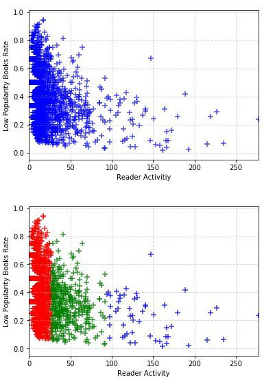

# 改进的北邮图书馆推荐系统介绍
## 核心算法
在图书推荐系统中，我们使用的核心算法是基于用户的**协同过滤算法（User-CF）**。User-CF是推荐系统应用最广泛的算法。我们在对北邮读者借阅行为的数据挖掘的基础上，在数据处理和算法构建两个方面进行了相应改进，并在研究基础上提出了一种用于实践的北邮图书馆推荐系统架构和一个推荐服务策略。
## User-CF算法
其核心原理就是通过计算所有用户之间借阅操作矩阵的余弦相似度。将符合被推荐人兴趣的，且没有阅读过的书籍推荐给他。我们的推荐系统集成了**User-CF**、**基于标签推荐**、**考虑用户特征**这三种算法。
## 系统改进
为了构建优于广泛应用于一般网络书店或城市图书馆的基础推荐算法，我们考虑了**用户借阅行为和图书热度的特殊的概率分布**，**用户行为的时空特征**，**用户属性特征和图书标签的匹配**三个内容。我们以提高算法准确度、覆盖度、多样性、新颖性为标准，对推荐引擎进行了改进和测试。

关于用户活跃度和书籍热度的关系：

